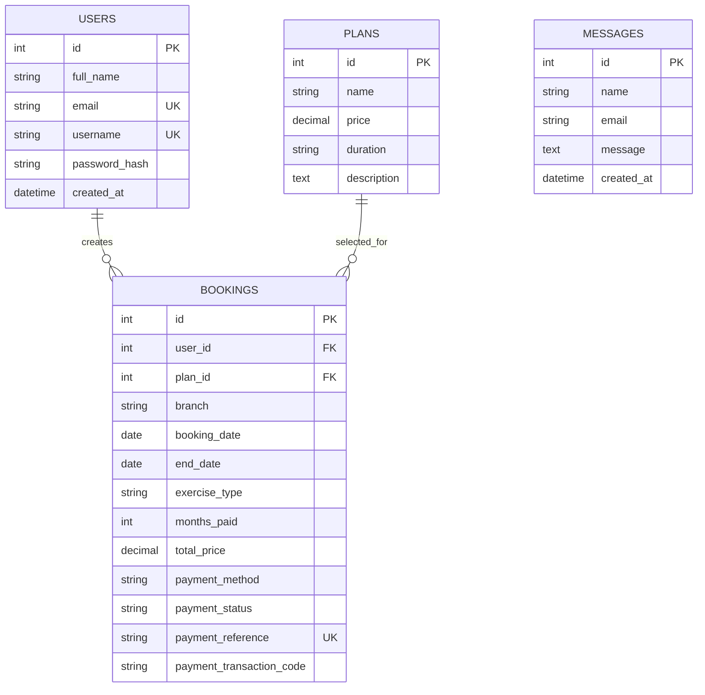
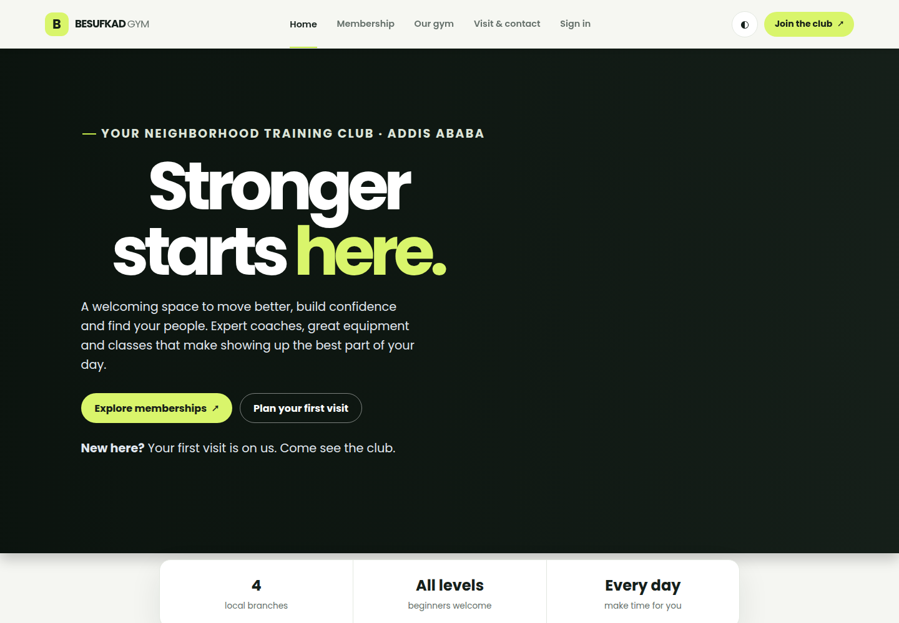
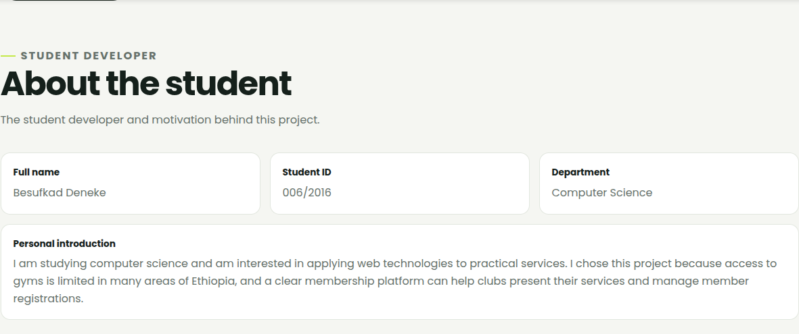
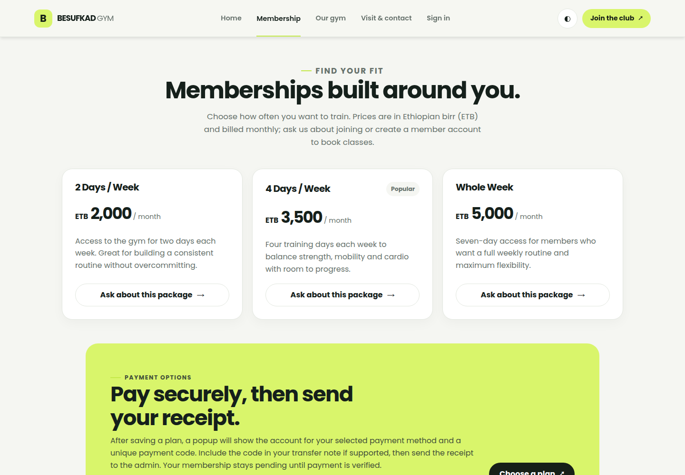
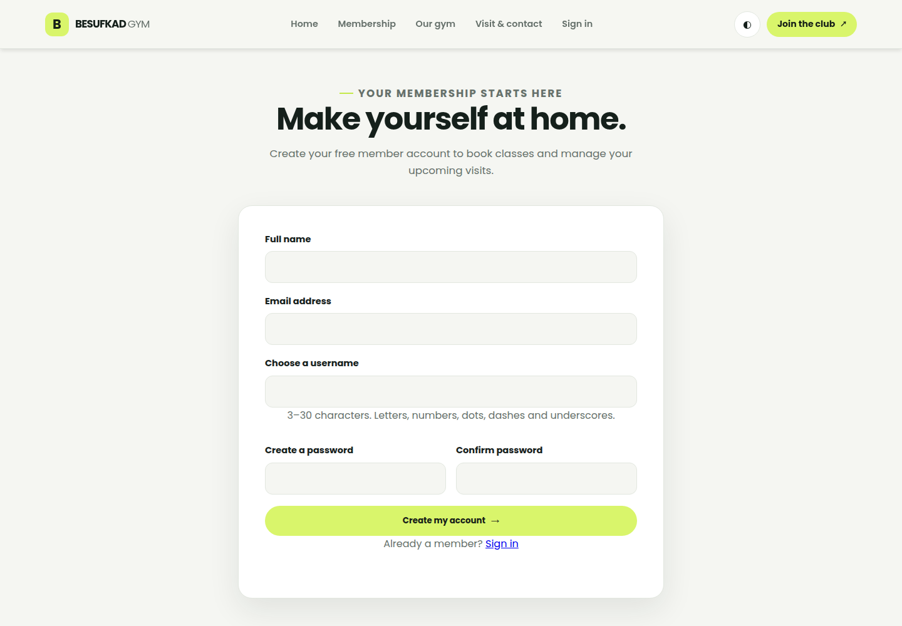
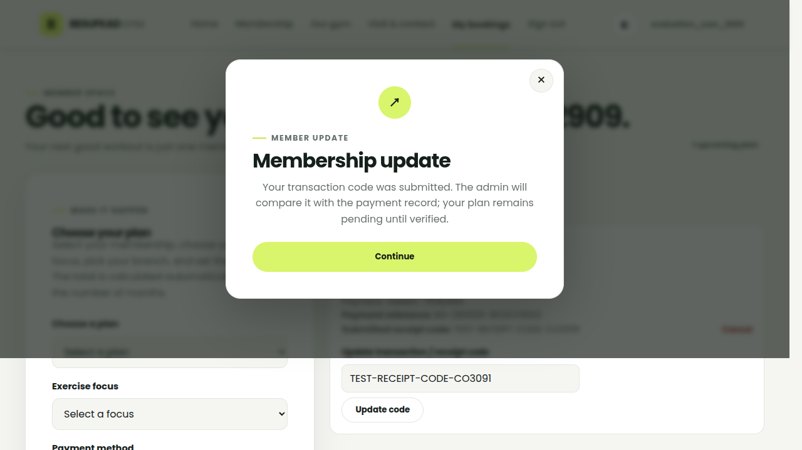
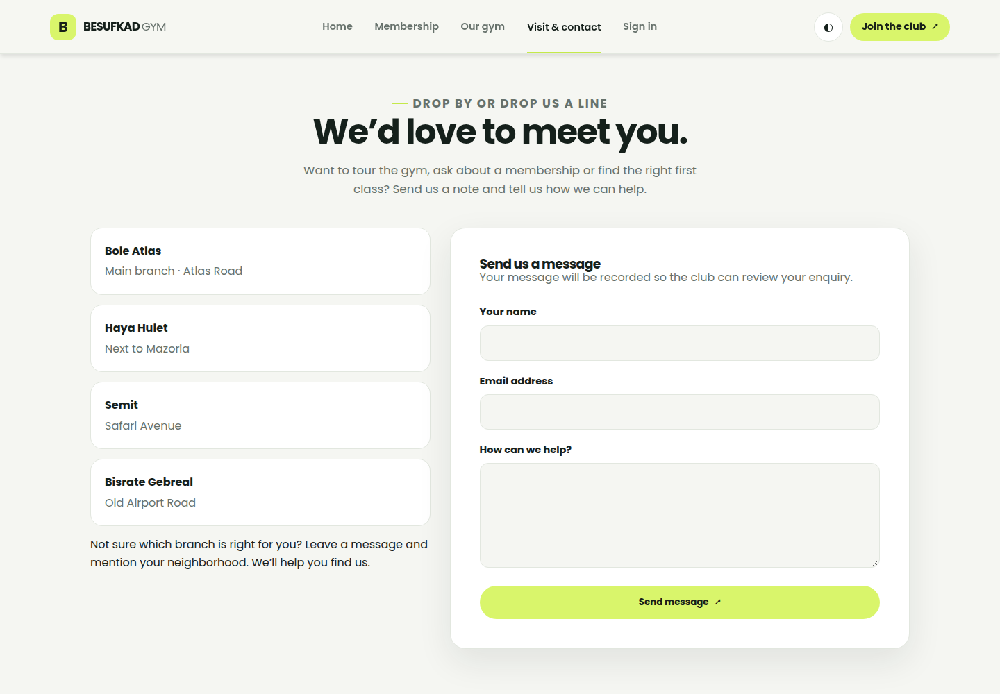

# CoSc3091 Individual Assignment Report

## Besufkad Gym Club Membership System

**Student:** Besufkad Deneke  
**Student ID:** 006/2016  
**Department:** Computer Science  
**Course:** CoSc3091 — Web Programming  
**Submission date:** 29 September 2026

## 1. Project overview

The Besufkad Gym Club Membership System is a responsive website for a fictional gym with branches in Addis Ababa. Visitors can review the gym and membership options, register and sign in, and send a contact enquiry. Signed-in members can create a membership plan by selecting a package, training focus, branch, start date, duration, and payment method. Each membership is saved in MySQL and receives a unique payment reference. Members can submit the transaction code printed on their payment receipt so the gym can manually compare it with its payment records.

Payment is not processed automatically. A submitted transaction code does not itself prove payment; the membership remains pending until the administrator confirms the receipt.

## 2. Main features

- Seven linked pages: Home, About, Membership, Contact, Register, Login, and member Dashboard; logout is also available to signed-in members.
- Responsive navigation and layouts using CSS Grid, Flexbox, and mobile breakpoints; light/dark theme toggle.
- Registration with required-field, email, username, and password validation, duplicate checks, and password hashing.
- Session-based authentication, protected dashboard, and logout.
- Database-backed membership creation, plan pricing, branch/focus selection, duration calculation, unique payment reference, and future-plan cancellation.
- Per-membership payment receipt transaction-code submission for manual verification.
- Contact form messages persisted in the database.
- CSRF tokens on forms, MySQLi prepared statements, and HTML output escaping.

## 3. Database design

The schema is defined in `database.sql`. It contains four tables:

| Table | Purpose | Key relationships |
| --- | --- | --- |
| `users` | Member profile and password hash | One user can own many bookings |
| `plans` | Membership plan name, monthly price, duration, and description | One plan can be referenced by many bookings |
| `bookings` | Member membership selection, dates, price, payment method/status, unique reference, and submitted receipt transaction code | Foreign keys to `users` and `plans` |
| `messages` | Contact form submissions | Independent enquiry records |

Passwords are stored as hashes, never as submitted plain text. Booking and plan relationships use foreign keys; contact submissions are kept separately.

## 4. Implementation and testing

The application uses HTML5 semantic page structure, shared PHP header/footer includes, external CSS and JavaScript, PHP sessions, MySQLi prepared statements, and server-side validation. The database is seeded with the three monthly plans: 2 Days / Week (ETB 2,000), 4 Days / Week (ETB 3,500), and Whole Week (ETB 5,000).

Validation performed during development:

- PHP syntax checks across all application and include files.
- JavaScript syntax check with Node.js.
- Browser checks of registration/login/contact messaging dialogs, plan selection, payment destination dialog, unique payment reference, receipt-code submission, and membership cancellation.
- MySQL checks confirmed membership bookings and receipt transaction codes persist in the database.

## 5. Screenshots

Screenshots below were captured from the running application. The dashboard example uses a temporary test account and synthetic transaction code; no real payment data is shown.

## 6. Individual contribution

**Draft statement — confirm and edit so it accurately describes your work:** I, Besufkad Deneke, designed and implemented the Besufkad Gym Club Membership System for the CoSc3091 individual assignment. My work includes the page layouts and responsive styling, PHP registration and session-based login, MySQL schema and prepared-statement integration, membership booking and payment-reference workflow, validation, testing, and project documentation.

## 7. Submission checklist

- [ ] Confirm that the student profile information and biography are accurate.
- [ ] Confirm/edit the individual contribution statement.
- [ ] Check screenshots and report PDF before submitting.
- [ ] Review the final ZIP and README setup instructions.
- [ ] Submit the public GitHub repository URL, ZIP, and (if deployed) live URL.
